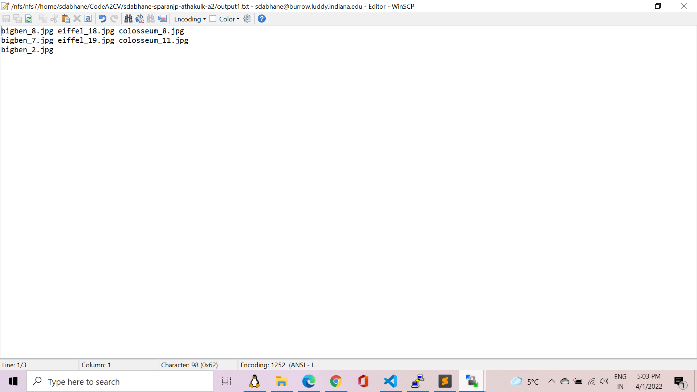

# Part 1: Image matching and clustering

## Function used
For this part, we have written a function:image_matching_and_clustering() which takes 3 arguments: 

1. images, which is an array consisting of numpy arrays of each image
2. arr, which is the list of images present
3. k, number of clusters given 

This function will take these parameters and cluster the images given according to a clustering algorithm(Agglomerative Clustering in this case) and give us clusters of images.
There are 2 parts to this function: image matching and clustering. 

### Image Matching
Image matching is a technique where we try and find similar "features" of 2 images and match them.
There can be multiple images of the same object taken but they might have different orientations, different lighting and even different scale. But they are ultimately, the images of the same object and should be categorized as such.

1. Initially, we created a matrix of dimensions number of images by number of images. This matrix will store the number of matches for each pair of images. 
   
2. We then used https://docs.opencv.org/4.x/dc/dc3/tutorial_py_matcher.html as reference to do Brute-Force Matching with ORB descriptors. We used the bf.knnMatch function to find the closest k matches or keypoints, in this case, we set k=2, so that we can use the Lowe ratio test to use only the good matches. (https://link.springer.com/article/10.1023/B:VISI.0000029664.99615.94).

According to the Lowe test, if the ratio of the distance of the closest and second closest match is below a certain threshold, we can consider that to be a good match, otherwise, we eliminate those keypoints.

### Image Clustering

1. After finding the good keypoint matches for each pair of images, we performed clustering on the matrix obtained. We used the AgglomerativeClustering library function to perform this operation. (https://scikit-learn.org/stable/modules/generated/sklearn.cluster.AgglomerativeClustering.html). We tried various affinity parameter values and linkages, and cosine affinity and complete linkage Agglomerative clustering gave us the best results. We obtain the image and the cluster number it belongs to in the result for each image. 
   
2. Once we obtain the results of the clustering, we checked the Pairwise Clustering Accuracy. To do this, we stored the results of clustering in 2 dictionaries. The first dictionary contained the cluster number as the key and the images that belonged to those clusters as the list of values for that key, and the second dictionary contained the image name as the key and corresponding cluster as the value. 
   
3. To check the Pairwise Clustering Accuracy, we checked if the images of the same monument or object are in the same cluster or not. To do this, we took each pair of images and checked if they are of the same monument. If the images are of the same monument and belong in the same cluster, then that's a true positive case. If the images are of different monument and belong in different clusters, then that's a true negative case. We carried out the calculation by adding the true positive and true negative cases and divided it by the total number of possible pairs. We then printed this accuracy. 
   
4. To store the clusters in a text file, we just used the first dictionary which had the cluster numbers and images corresponding to that cluster. We wrote each cluster into the file line by line. 

## Limitations

1. During the calculation of the clusters, for certain cases, there were failures. For example, for this case: 

        python3 a2.py part1 3 part1-images/bigben_2.jpg part1-images/bigben_7.jpg part1-images/bigben_8.jpg part1-images/eiffel_18.jpg part1-images/eiffel_19.jpg part1-images/colosseum_8.jpg part1-images/colosseum_11.jpg output1.txt

the accuracy came out to be only 47.61%. There were 0 true positives and 20 true negatives. 

# Part 2: Image transformations

### Image Warping:
Image warping means that the image is transformed using a 3x3 Transformation matrix.
We have written a function warp() which takes an image which is to be transformed and the transformation matrix as its arguments.
We have used bilinear interpolation along with inverse warping as specified in the assignemnt. Using inverse warping aviods holes in the warped image and bilinear transformation helps smoothen the image.
To write the code for bilinear transformation, I watched the following video https://youtu.be/UhGEtSdBwIQ  and followed its steps.
To test this function we tested it on the given "lincoln.jpg" image to confirm if warp() worked correctly.

  
### Finding the transformation matrix from given correspondenses:

The results for transformation on the book image from the assignemnt are: 

**1) Translation n=1:**  
Translation uses only one pair of point correspondence between 2 images. 

 

**2) Euclidean n=2:** 
Euclidean transformation consists of Translation as well as Rotation.
The transformation matrix here will be of the following format 

Here a and b are the cosins(theta) and sine(theta) terms where theta is the angle of rotation. c and d are the translations.
I used above matrix along with point correspondenses to find linear equations and solved the linear system of equations to find the 4 unknowns. 

 

**3) Affine n=3:** 
There are 6 unknowns to find in the transformation matrix for affine transformation. 
 
I used above matrix along with point correspondenses to find linear equations and solved the linear system of equations to find the 6 unknowns. 

**4) Projective n=4:** 
There are 9 unknowns in the transformation matri for projective transformation.  
I used the method shown by the professor in one of the ppts to solve the projective transformation. 
I used aove matrix along with point correspondenses to find linear equations and solved the linear system of equations to find the 4 unknowns. 

 
We also tested the transformations on the building image which was in the assignment named as scene1 and scene2.  

 
The results from those images are as follows. 
We tested both types of transformations which are as follows:
The corresponding point matches of the above images were manually found out using Paint. 
1) Transforming scene2 as per scene1: 
Following command was run to test this. 
python a2.py part2 4 scene2.jpg scene1.jpg scene_output1.jpg 476,243 220,328 449,246 192,332 700,73 442,158 671,363 414,449 

 
2) Transforming scene1 as per scene2: 
Following command was run to test this. 
python a2.py part2 4 scene1.jpg scene2.jpg scene_output2.jpg 220,328 476,243 192,332 449,246 442,158 700,73 414,449 671,363 

 

## Limitations:
The code fails to tranform the image correctly if the corresponding points have errors.
We tried to find corresponding points manually on a high resolution image but there are some manual errors which are introduced. This results in a poorly transformed image.
The following is one such example.
python a2.py part2 4 src.jpg dest.jpg bhutan.jpg 167,801 617,1133 723,1693 1057,1930 725,2075 1019,2391 335,141 843,437 

# Part 3: Automatic image matching and transformations

## Limitations
